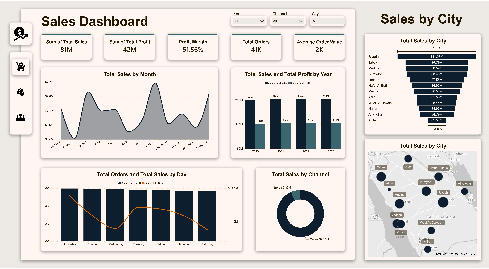
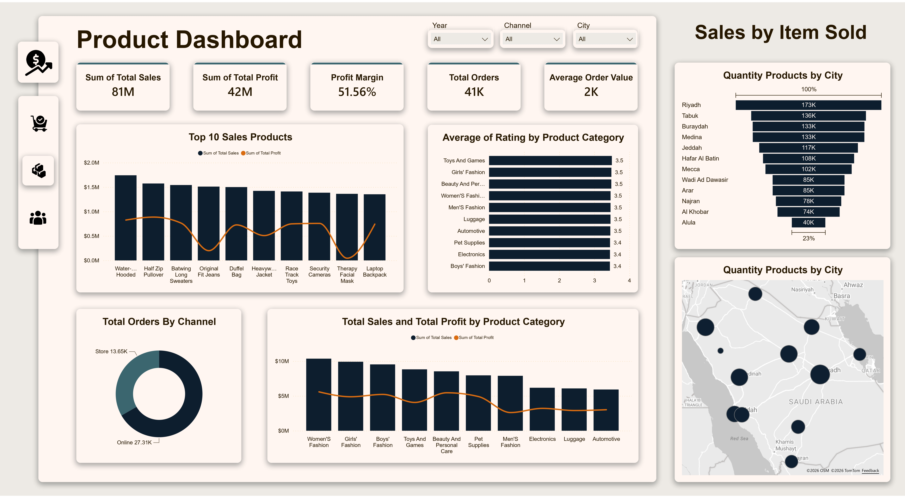
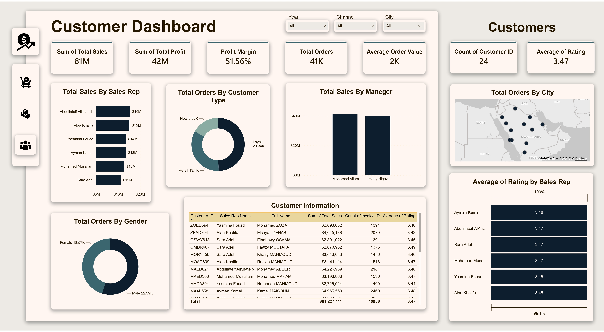

# Multi-Sales Dashboard

Power BI dashboard for analyzing sales, products, and customers from multiple data sources.

## Overview

This project contains three main report pages:

- Sales Dashboard
- Product Dashboard
- Customer Dashboard

## Screenshots

### 1. Sales Dashboard



This page focuses on overall sales performance.

- Tracks total sales, total profit, profit margin, total orders, and average order value.
- Shows sales trends by month and year.
- Breaks down sales by city, channel, and day.
- Includes a map view for geographic performance.

### 2. Product Dashboard



This page analyzes product performance and categories.

- Highlights top-selling products.
- Compares sales and profit by product category.
- Shows product ratings by category.
- Displays quantity distribution by city and channel.

### 3. Customer Dashboard



This page summarizes customer and sales representative performance.

- Shows sales by sales rep and by manager.
- Breaks orders down by customer type and gender.
- Displays customer details in a table.
- Includes city and rating analysis.

## Project Files

- `dashboard/multi_sales_dashboard.pbix` - main Power BI report
- `data/` - source Excel databases
- `assets/icons/` - dashboard navigation and UI icons
- `dashboard/screenshots/` - report screenshots used in this README

## Data Sources

- `customer_database.xlsx`
- `product_database.xlsx`
- `sales_database.xlsx`

## Structure

```text
Multi-Sales-Dashboard/
├── assets/
│   └── icons/
├── data/
├── dashboard/
│   ├── multi_sales_dashboard.pbix
│   └── screenshots/
├── README.md
└── .gitignore
```

## Notes

The screenshots are stored locally in `dashboard/screenshots/`, so they will render directly on GitHub after pushing.
